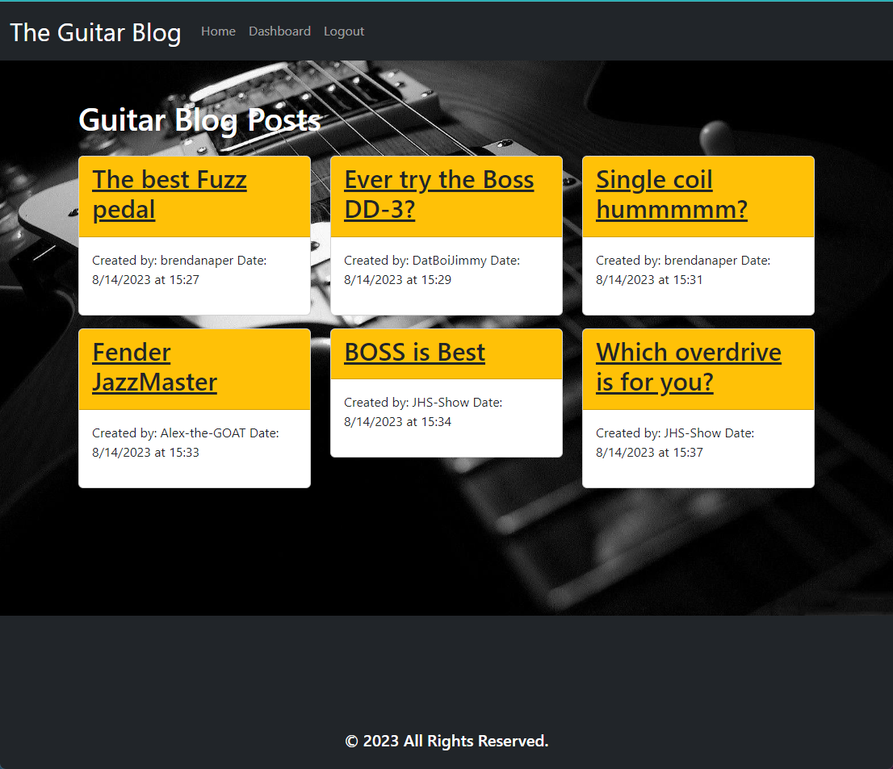

# The Guitar Blog

[](https://opensource.org/licenses/MIT)

The Guitar Blog is a heroku deployed application, designed as a platform for fellow guitar enthusiasts to share thoughts and ideas through blog posts. Users can sign up or log in to access the full functionality of the site. Once logged in, users can view existing blog posts, create new posts, update their own posts, leave comments, and manage their account settings.

## Features

- **Homepage**
  - View existing blog posts
  - Navigation links to the homepage, dashboard, and login/logout option

- **Authentication**
  - Sign up with a username and password
  - Log in using registered credentials
  - Idle timeout functionality for enhanced security

- **Dashboard**
  - View and manage user's own blog posts
  - Create new blog posts with a title and content
  - Update or delete existing blog posts

- **Blog Posts**
  - View individual blog posts with title, content, creator's username, and creation date
  - Leave comments on blog posts
  - Comments display the commenter's username and creation date

  ## Installation

You can view the app by clicking this [link](https://brendan-aper-guitar-blog-860b800615d1.herokuapp.com/).

**Alternatively** you can follow these steps to install the app locally.

[GitHub Repo](https://github.com/brendan-aper/Tech-Blog)

1. Clone the repository:

```
  git clone https://github.com/brendan-aper/Tech-Blog.git
```

2. Navigate to the project directory:

```
  cd tech-blog
```

3. Install dependencies:

```
  npm install
```

4. Create environment variables file:

```
  touch .env
```

5. Create environment variables:

```
  DB_NAME = "blogPost_db"
  DB_USER = "root"
  DB_PASSWORD = "Your Password"
  SECRET = "Your Secret"
```

6. Set up MYSQL Database:

```
  mysql -u root -p;
  'your password';

  source (copy path of schema.sql file in db directory);
```

7. Run Seeds:

```
  npm run seed
```

<hr>



<hr>

## Usage

1. Start the server: 

```
npm start
```

2. Open your web browser and visit http://localhost:3001

3. Explore The Guitar Blog

## Contact

Follow me on [Github](https://github.com/brendan-aper)

**OR**

If you have any questions feel free to [email me](mailto:brendanaper@gmail.com).

## License

This project is licensed under the MIT License.

Copyright (c) 2023 brendan-aper

Permission is hereby granted, free of charge, to any person obtaining a copy
of this software and associated documentation files (the "Software"), to deal
in the Software without restriction, including without limitation the rights
to use, copy, modify, merge, publish, distribute, sublicense, and/or sell
copies of the Software, and to permit persons to whom the Software is
furnished to do so, subject to the following conditions:

The above copyright notice and this permission notice shall be included in all
copies or substantial portions of the Software.

THE SOFTWARE IS PROVIDED "AS IS", WITHOUT WARRANTY OF ANY KIND, EXPRESS OR
IMPLIED, INCLUDING BUT NOT LIMITED TO THE WARRANTIES OF MERCHANTABILITY,
FITNESS FOR A PARTICULAR PURPOSE AND NONINFRINGEMENT. IN NO EVENT SHALL THE
AUTHORS OR COPYRIGHT HOLDERS BE LIABLE FOR ANY CLAIM, DAMAGES OR OTHER
LIABILITY, WHETHER IN AN ACTION OF CONTRACT, TORT OR OTHERWISE, ARISING FROM,
OUT OF OR IN CONNECTION WITH THE SOFTWARE OR THE USE OR OTHER DEALINGS IN THE
SOFTWARE.